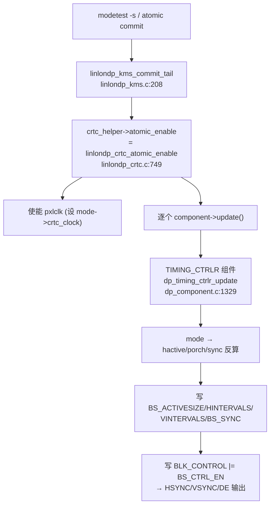

## 一、先建立概念模型：时序信号是什么

Display Controller 产生的不是图像，而是**节拍**——一套周期性的方波信号，告诉屏幕"现在画第几行第几个像素 / 现在该回扫了"：

| 信号 | 含义 |
|---|---|
| **PCLK**（像素时钟） | 每个脉冲走一个像素，是整个时序的"心跳" |
| **HSYNC** | 一行结束、水平回扫 |
| **VSYNC** | 一帧结束、垂直回扫 |
| **DE**（Data Enable） | 当前是否在有效显示区（active），高电平才送像素 |

一行/一帧不是只有可见像素，还有"看不见的边沿时间"——这就是 porch（肩）和 sync（同步脉宽）：

```
一行(htotal) = hactive(可见) + hfront_porch(前肩) + hsync_len(同步) + hback_porch(后肩)
一帧(vtotal) = vactive       + vfront_porch        + vsync_len       + vback_porch
```

## 二、CRTC 产生时序的本质：把 mode 翻译成寄存器

`drm_display_mode` 里存的是"人类时序参数"，CRTC enable 时把它们**算成边沿区间、写进时序控制器寄存器**，硬件就自动按 PCLK 节拍生成 HSYNC/VSYNC/DE。这段就是 dp_component.c。

### 第 1 步：从 mode 反算出四段时序

dp_component.c
```c
hactive      = mode->crtc_hdisplay;                          // 可见宽度
hfront_porch = mode->crtc_hsync_start - mode->crtc_hdisplay; // 前肩 = sync起点 - 可见结束
hsync_len    = mode->crtc_hsync_end   - mode->crtc_hsync_start; // 同步脉宽
hback_porch  = mode->crtc_htotal      - mode->crtc_hsync_end;   // 后肩 = 总长 - sync结束
// vertical 四个量完全同理
```

注意用的是 `crtc_*` 前缀字段（不是 `hdisplay` 而是 `crtc_hdisplay`）——这是经过 `mode_fixup` 调整后的**最终硬件时序**（可能因 interlace、缩放、双链路而改）。这正是 mode 结构里"两套时序"的用意。

### 第 2 步：写进时序控制器寄存器

dp_component.c
```c
linlondp_write32(reg, BS_ACTIVESIZE, HV_SIZE(hactive, vactive));       // 可见区尺寸
linlondp_write32(reg, BS_HINTERVALS, BS_H_INTVALS(hfront_porch, hback_porch)); // 水平前后肩
linlondp_write32(reg, BS_VINTERVALS, BS_V_INTVALS(vfront_porch, vback_porch)); // 垂直前后肩

value = BS_SYNC_VSW(vsync_len) | BS_SYNC_HSW(hsync_len);   // 同步脉宽
value |= mode->flags & DRM_MODE_FLAG_PVSYNC ? BS_SYNC_VSP : 0;  // 同步极性(正/负)
value |= mode->flags & DRM_MODE_FLAG_PHSYNC ? BS_SYNC_HSP : 0;
linlondp_write32(reg, BS_SYNC, value);
```

这几行就是"产生时序信号"的**物理动作**：把 active/porch/sync/极性四类参数灌进 DPU 的 backend scaler 时序块（`BS_` = backend）。写完之后硬件内部的计数器就按这些边界跑。

### 第 3 步：使能时序控制器（信号开始输出）

dp_component.c
```c
value = BS_CTRL_EN;                                  // ← 关键：使能位，时序开始跑
if (pipe->base.en_test_pattern) value |= BS_CTRL_TM; // 测试图案
value |= is_writeback_only(crtc_st) ? BS_CTRL_VD : BS_CTRL_VM; // 输出到内存 or 显示
...
linlondp_write32(reg, BLK_CONTROL, value);           // 一写，HSYNC/VSYNC/DE 开始输出
```

写下 `BS_CTRL_EN` 这一刻，时序控制器开始按计数器吐 HSYNC/VSYNC/DE。对应的 disable 就一行（dp_component.c）：清 `BS_CTRL_EN`。

## 三、还差一半：像素时钟 PCLK

时序计数器需要节拍源。porch/sync 决定"形状"，**PCLK 决定"快慢"**（刷新率）。这部分不在时序块里，而在 pipeline 的 `pxlclk`：

- linlondp_pipeline.c 持有 `pipe->pxlclk`（一个标准 Linux `clk`）
- 目标频率就是 `mode->crtc_clock`（kHz），关系是：
$$\text{PCLK} = \text{htotal} \times \text{vtotal} \times \text{刷新率}$$
- dp_component.c 那段 `aclk_rate * denominator >= mode->crtc_clock * 1000` 是在校验**内部 AXI 时钟够不够带这个像素时钟**（即够不够带宽刷这个分辨率）。

所以完整的"产生时序"= **设对 PCLK 频率（快慢） + 写对 porch/sync 寄存器（形状） + 置 EN（开闸）**。

## 四、谁调用了它：从 atomic_enable 串到这里



`TIMING_CTRLR` 这个组件就是代码里的 linlondp_pipeline.c，它的 `.update` 函数指针指向 `dp_timing_ctrlr_update`——这是上一轮讲的"函数指针过箭头"的又一个实例。

## 五、一张图记住时序与寄存器的对应

```
        |<--hsync-->|<-hback->|<------ hactive ------>|<-hfront->|
HSYNC  _|‾‾‾‾‾‾‾‾‾‾‾|_________________________________________ 
                              BS_SYNC      BS_HINTERVALS   BS_ACTIVESIZE
DE     ___________________|‾‾‾‾‾‾‾‾‾‾‾‾‾‾‾‾‾‾‾‾‾‾‾‾‾‾‾|_________
PCLK   ‖‖‖‖‖‖‖‖‖‖‖‖‖‖‖‖‖‖‖‖‖‖‖‖‖‖‖‖‖‖‖‖‖‖‖‖‖‖‖‖‖‖‖‖‖   ← pxlclk = crtc_clock
```

## 一句话总结

CRTC（这里是 linlondp 的 TIMING_CTRLR 组件）产生时序信号的本质，是在 enable 时把 `drm_display_mode` 的 `crtc_*` 时序反算成 **hactive/前后肩/同步脉宽**（dp_component.c），写进 `BS_ACTIVESIZE/BS_HINTERVALS/BS_VINTERVALS/BS_SYNC` 寄存器并配好极性，再设对像素时钟 `pxlclk = mode->crtc_clock`（决定刷新率），最后写 `BLK_CONTROL |= BS_CTRL_EN`（dp_component.c:1387）开闸——硬件计数器据此按 PCLK 节拍持续输出 HSYNC/VSYNC/DE，整条调用链由 linlondp_crtc.c 经组件 `.update` 触发。
