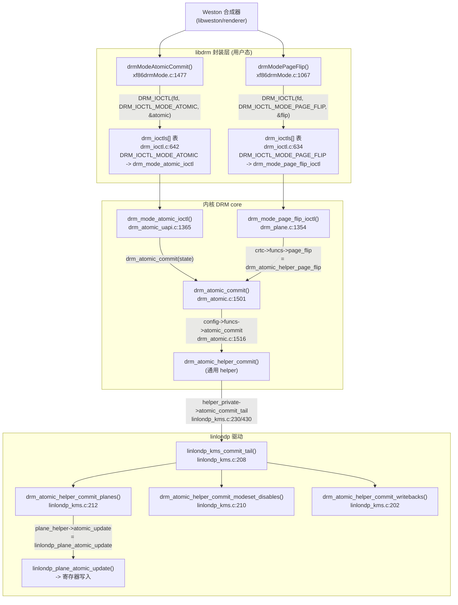

# Weston 追到 linlondp 寄存器的完整链路

## 全链路总览

Weston 有两条路径提交帧，最终都汇入同一个驱动入口：



## 逐层拆解

### 第 1 层：Weston -> libdrm

Weston 每合成完一帧，通过 libdrm 提交。现代 Weston 默认走 **atomic** 路径：

```c
// Weston 构造 atomic request：逐个对象逐个属性设置
drmModeAtomicAddProperty(req, crtc_id, prop_fb_id, new_fb_id);
drmModeAtomicAddProperty(req, crtc_id, prop_mode_id, mode_id);
// ... 然后一次性提交
drmModeAtomicCommit(fd, req, DRM_MODE_ATOMIC_NONBLOCK, &page_flip_data);
```

libdrm 的 xf86drmMode.c 做的事：
1. **排序去重**：把用户态零散 add 的 `(object_id, prop_id, value)` 三元组按 object_id -> prop_id 排序，去掉重复设置
2. **打包成扁平数组**：`objs_ptr`/`count_props_ptr`/`props_ptr`/`prop_values_ptr` 四个数组
3. 填入 `struct drm_mode_atomic`，发一次 ioctl

legacy 路径更简单：直接填 `drm_mode_crtc_page_flip` 结构发 ioctl。

### 第 2 层：ioctl 分发（drm_ioctls[] 静态表）

drm_ioctl.c 的静态表，两个入口：

```c
DRM_IOCTL_DEF(DRM_IOCTL_MODE_PAGE_FLIP, drm_mode_page_flip_ioctl, DRM_MASTER),  // L634
DRM_IOCTL_DEF(DRM_IOCTL_MODE_ATOMIC,    drm_mode_atomic_ioctl,    DRM_MASTER),  // L642
```

都标了 `DRM_MASTER`--只有 master 能做 modeset/page_flip。

### 第 3 层：两条路径如何汇流

**Atomic 路径**（drm_atomic_uapi.c）：
1. 检查 `DRIVER_ATOMIC` 能力位
2. 检查 `file_priv->atomic`（用户态必须先 `drmSetClientCap(ATOMIC)`）
3. 分配 `drm_atomic_state`，遍历用户态传来的属性数组，逐个调 `drm_atomic_set_property()` 填进 state
4. `prepare_signaling()`（处理 fence/event）
5. 根据 flags 分三路：
   - `TEST_ONLY` -> `drm_atomic_check_only()`（只验证不提交）
   - `NONBLOCK` -> `drm_atomic_nonblocking_commit()`
   - 否则 -> `drm_atomic_commit()`

**Page flip 路径**（drm_plane.c）：
1. 找到 crtc 和 primary plane
2. 调 `crtc->funcs->page_flip`--linlondp 挂的是通用 helper
3. 这个 helper **内部构造一个 atomic_state**（只改 primary plane 的 fb_id），然后调 `drm_atomic_commit()`

**所以 page_flip 是 atomic 的语法糖**--两条路最终都到 drm_atomic.c。

### 第 4 层：drm_atomic_commit -> 驱动入口

drm_atomic.c 做两件事：
```c
ret = drm_atomic_check_only(state);           // ① 先校验整个 state
return config->funcs->atomic_commit(dev, state, false);  // ② 间接调用驱动
```

`config->funcs->atomic_commit` 是函数指针--linlondp 挂的是通用 helper `drm_atomic_helper_commit`。

### 第 5 层：helper -> 驱动私有 commit_tail

`drm_atomic_helper_commit` 内部会调 `helper_private->atomic_commit_tail`--这是 linlondp **真正的私有入口**：

```c
static void linlondp_kms_commit_tail(struct drm_atomic_state *old_state)
{
    drm_atomic_helper_commit_modeset_disables(dev, old_state);  // L210 关闭旧状态
    drm_atomic_helper_commit_planes(dev, old_state, ...);       // L212 ← 核心：逐 plane 调 atomic_update
    drm_atomic_helper_commit_modeset_enables(dev, old_state);   // 开启新状态
    drm_atomic_helper_commit_hw_done(state);                    // L106 通知硬件完成
    drm_atomic_helper_wait_for_vblanks(dev, old_state);         // 等 vblank
    drm_atomic_helper_commit_writebacks(dev, old_state);        // L202 writeback
    ...
}
```

`drm_atomic_helper_commit_planes` 会遍历所有变化的 plane，调 `plane->helper_private->atomic_update`--这就是最终写寄存器的地方（把新 fb 的地址/格式/偏移写进 DPU 的 layer 寄存器）。

### 第 6 层：vblank event 回路

Weston 提交时带了 `DRM_MODE_PAGE_FLIP_EVENT` flag，内核在 vblank 到来时通过 `drm_send_event_locked()` 把事件写回 card0 的 fd。Weston 在 `poll()` 上等这个事件，收到后才知道"这帧已上屏，可以准备下一帧"--这就是 page flip 的异步回调闭环。

## 两条路径的对比

| | legacy page_flip | atomic commit |
|---|---|---|
| libdrm API | `drmModePageFlip()` | `drmModeAtomicCommit()` |
| ioctl | `MODE_PAGE_FLIP` | `MODE_ATOMIC` |
| 能改什么 | 只能换 primary plane 的 fb | 任意对象的任意属性 |
| 内核入口 | `drm_mode_page_flip_ioctl` | `drm_mode_atomic_ioctl` |
| 是否构造 atomic_state | helper 内部自动构造 | 用户态显式构造 |
| 最终汇合点 | -> `drm_atomic_commit()` | -> `drm_atomic_commit()` |
| 驱动入口 | 同一个 `linlondp_kms_commit_tail` | 同一个 |

## 一句话总结

Weston 通过 libdrm 的 `drmModeAtomicCommit()`（或 legacy 的 `drmModePageFlip()`）发 ioctl，经 drm_ioctl.c:634 的 `drm_ioctls[]` 表分发到 `drm_mode_atomic_ioctl`（page_flip 路径由 helper 自动转 atomic），两条路汇入 `drm_atomic_commit()` -> `config->funcs->atomic_commit` -> `helper_private->atomic_commit_tail`（`linlondp_kms_commit_tail`，linlondp_kms.c:208）-> `commit_planes` 逐 plane 调 `atomic_update` 写寄存器，vblank 到来后 event 回传 card0 fd 通知 Weston 上一帧已上屏。
