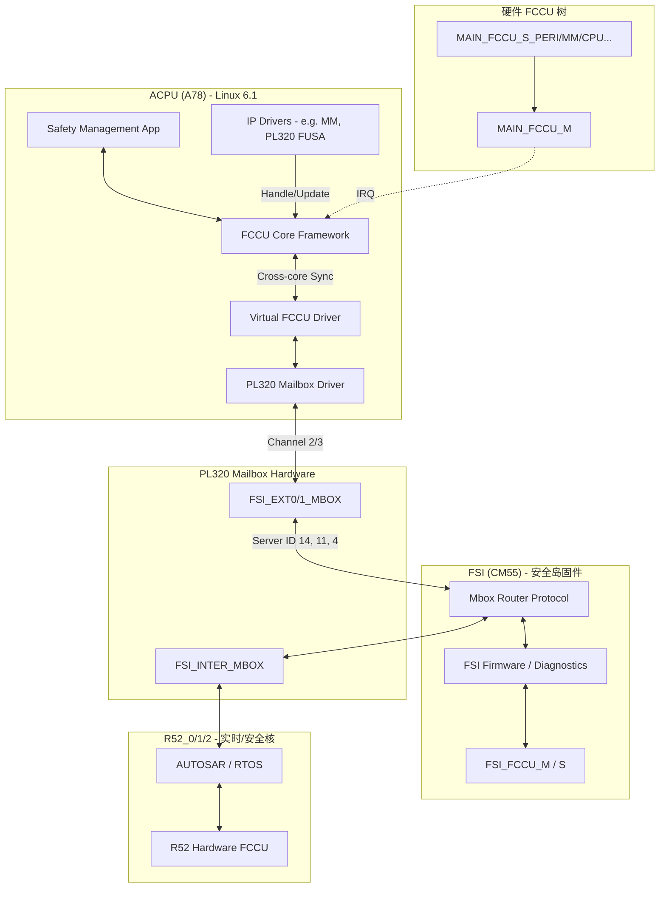
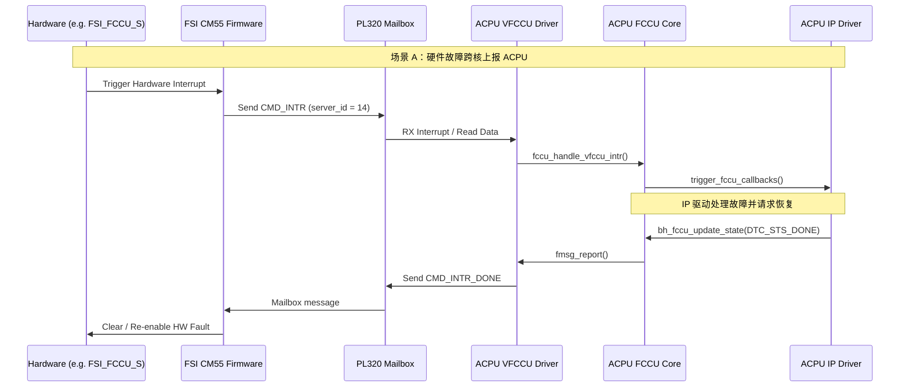
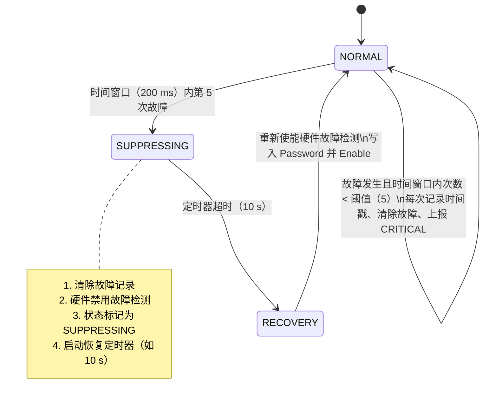

```c
#include <common.h>

#include <clk.h>

#include <dm.h>

#include <log.h>

#include <mailbox-uclass.h>

#include <malloc.h>

#include <asm/io.h>

#include <dm/device_compat.h>

#include <linux/bitops.h>

#include <linux/bitmap.h>

  

#define IPCMxSOURCE(m)      ((m) * 0x40)

#define IPCMxDSET(m)        (((m) * 0x40) + 0x004)

#define IPCMxDCLEAR(m)      (((m) * 0x40) + 0x008)

#define IPCMxDSTATUS(m)     (((m) * 0x40) + 0x00C)

#define IPCMxMODE(m)        (((m) * 0x40) + 0x010)

#define IPCMxMSET(m)        (((m) * 0x40) + 0x014)

#define IPCMxMCLEAR(m)      (((m) * 0x40) + 0x018)

#define IPCMxMSTATUS(m)     (((m) * 0x40) + 0x01C)

#define IPCMxSEND(m)        (((m) * 0x40) + 0x020)

#define IPCMxDR(m, dr)      (((m) * 0x40) + ((dr) * 4) + 0x024)

  

#define IPCMMIS(irq)        (((irq) * 8) + 0x800)

#define IPCMRIS(irq)        (((irq) * 8) + 0x804)

  

#define MBOX_MASK(n)        (1 << (n))

#define CHAN_MASK(n)        (1 << (n))

  

#define PL320_MAX_CHANS     32

  

struct bh_mbox_chan {

    uint8_t idx;

    uint8_t intr_s;

    uint8_t intr_d;

    uint32_t resp[7];

    bool master;

};

  

struct bh_mailbox {

    void __iomem *reg;

    struct bh_mbox_chan bh_chan[PL320_MAX_CHANS];

};

  

static void __ipc_send(struct mbox_chan *chan, uint32_t *data)

{

    struct bh_mailbox *mbox = dev_get_priv(chan->dev);

    struct bh_mbox_chan *bh_chan = chan->con_priv;

    int i;

  

    for (i = 0; i < 7; i++)

        writel( data[i], mbox->reg + IPCMxDR(bh_chan->idx, i));

    writel(0x1, mbox->reg + IPCMxSEND(bh_chan->idx));

}

  

static uint32_t __ipc_rcv(struct mbox_chan *chan,  uint32_t *data)

{

    struct bh_mailbox *mbox = dev_get_priv(chan->dev);

    struct bh_mbox_chan *bh_chan = chan->con_priv;

    int i;

  

    for (i = 0; i < 7; i++) {

        data[i] = readl(mbox->reg + IPCMxDR(bh_chan->idx, i));

    }

    return data[0];

}

  
  

static inline void set_source_and_destination(struct mbox_chan *chan)

{

    struct bh_mailbox *mbox = dev_get_priv(chan->dev);

    struct bh_mbox_chan *bh_chan = chan->con_priv;

  

    debug("set mailbox: %d, M interrupt source: %d, S interrupt source: %d.\n", bh_chan->idx, bh_chan->intr_s, bh_chan->intr_d);

    writel(CHAN_MASK(bh_chan->intr_s), mbox->reg + IPCMxSOURCE(bh_chan->idx));

    writel(CHAN_MASK(bh_chan->intr_d), mbox->reg + IPCMxDSET(bh_chan->idx));

    writel(CHAN_MASK(bh_chan->intr_s) | CHAN_MASK(bh_chan->intr_d), mbox->reg + IPCMxMSET(bh_chan->idx));  // The write-only IPCMxMSET Registers

}

  

/**

 * Request for mailbox channel

 * @chan:   Channel Pointer

 */

static int bh_mbox_request(struct mbox_chan *chan)

{

    debug("%s(chan=%p)\n", __func__, chan);

  

    set_source_and_destination(chan);

    return 0;

}

  

/**

 * Free the mailbox channel

 * @chan:   Channel Pointer

 */

static int bh_mbox_free(struct mbox_chan *chan)

{

    debug("%s(chan=%p)\n", __func__, chan);

  

    return 0;

}

  

static int bh_mbox_of_xlate(struct mbox_chan *chan,

                 struct ofnode_phandle_args *args)

{

    struct bh_mailbox *mbox = dev_get_priv(chan->dev);

    struct bh_mbox_chan *bh_chan = mbox->bh_chan + chan->id;

  

    debug("%s(chan=%p)\n", __func__, chan);

  

    if (args->args_count != 3) {

        debug("Invalid args_count: %d\n", args->args_count);

        return -EINVAL;

    }

  

    bh_chan->idx = args->args[0] & 0xff;    

  

    if (args->args[0] & 0x100) {

        bh_chan->master = true;

        bh_chan->intr_s = args->args[1];

        bh_chan->intr_d = args->args[2];

    } else {

        bh_chan->intr_s = args->args[2];

        bh_chan->intr_d = args->args[1];

    }

  

    chan->con_priv = bh_chan;

  

    return 0;

}

  

static int bh_mbox_send(struct mbox_chan *chan, const void *data)

{

    struct bh_mailbox *mbox = dev_get_priv(chan->dev);

    struct bh_mbox_chan *bh_chan = chan->con_priv;

    unsigned int irq_stat;

  

    __ipc_send(chan, (uint32_t *)data);

    while (1) {

        irq_stat = readl(mbox->reg + IPCMxSEND(bh_chan->idx));

        debug("irq_stat = 0x%x!\n", irq_stat);

  

        if (irq_stat & 0x2) {

            writel(0x0, mbox->reg + IPCMxSEND(bh_chan->idx));

            __ipc_rcv(chan, bh_chan->resp);

            break;

        }

    }

  

    return 0;

}

  

static int bh_mbox_recv(struct mbox_chan *chan, void *data)

{

    struct bh_mailbox *mbox = dev_get_priv(chan->dev);

    struct bh_mbox_chan *bh_chan = chan->con_priv;

    unsigned int irq_stat, bit;

  

    dev_dbg(chan->dev, "chan=%p, data=%p\n", chan, data);

  

    // which mailbox caused the interrupt

    irq_stat = readl(mbox->reg + IPCMMIS(bh_chan->intr_s));

  

    for_each_set_bit(bit, (unsigned long *)&irq_stat, PL320_MAX_CHANS) {

        bh_chan = &mbox->bh_chan[bit];    

        if (!bh_chan->master) { // 如果是接受到slave发送的消息，则irq_stat是slave mailbox index

            __ipc_rcv(chan, data);

            debug("bit is : 0x%x\n", bit);

            writel(0x2, mbox->reg + IPCMxSEND(bh_chan->idx));   // 0x2 : send message to source core        

        }

    }

  

    return 0;

}

  

static int bh_mailbox_probe(struct udevice *dev)

{

    struct bh_mailbox *mbox = dev_get_priv(dev);

    fdt_addr_t addr;

  

    dev_dbg(dev, "\n");

  

    addr = dev_read_addr(dev);

    if (addr == FDT_ADDR_T_NONE)

        return -EINVAL;

  

    mbox->reg = (void __iomem *)addr;

  

    return 0;

}

  
  

static const struct udevice_id bh_mailbox_ids[] = {

    { .compatible = "arm,platform-pl320" },

    { }

};

  

struct mbox_ops bh_mbox_ops = {

    .of_xlate = bh_mbox_of_xlate,

    .request = bh_mbox_request,

    .rfree = bh_mbox_free,  

    .send = bh_mbox_send,

    .recv = bh_mbox_recv,

};

  

U_BOOT_DRIVER(bh_mailbox) = {

    .name = "bh_mailbox",

    .id = UCLASS_MAILBOX,

    .of_match = bh_mailbox_ids,

    .probe = bh_mailbox_probe,

    .priv_auto  = sizeof(struct bh_mailbox),

    .ops = &bh_mbox_ops,

};
```
# Mailbox 跨核故障状态同步架构分析

## 一、整体架构

### 1. 架构概览

系统包含多个异构处理器核，通过 Mailbox 实现跨核故障状态同步。核心链路如下：

```text
┌──────────────┐    PL320 Mailbox     ┌──────────────┐
│  ACPU (A78)  │◄────────────────────►│  CM55 (FSI)  │
│  Linux 6.1   │  FSI_EXT0/EXT1_MBOX  │  安全岛固件   │
└──────┬───────┘                      └──────┬───────┘
     │                                     │
     │  FSI_INTER_MBOX                     │  FSI 内部总线
     ▼                                     ▼
┌──────────────┐                      ┌──────────────┐
│ R52_0/1/2    │                      │  硬件 FCCU   │
│ (AUTOSAR)    │                      │  故障采集控制 │
└──────────────┘                      └──────────────┘
```

### 2. 角色分工

- ACPU（A78，Linux 6.1）：运行 Safety Management App、FCCU Core 和 Virtual FCCU 驱动，负责故障接收、分发与恢复状态回报。
- CM55（FSI）：作为安全岛固件侧控制中枢，负责 Router 协议分发、FSI 内部诊断处理，以及与硬件 FCCU 的联动。
- R52_0/1/2：运行 AUTOSAR 或 RTOS，负责实时/安全域故障处理，并通过 FSI 内部 Mailbox 与 CM55、ACPU 交互。
- 硬件 FCCU：负责底层故障采集与聚合，形成主从树状上报链路。

### 3. 整体架构与工作流



## 二、硬件层：PL320 Mailbox

### 1. 基本能力

PL320 是 ARM PrimeCell 硬件邮箱，每个邮箱实例有 32 个通道，每个通道可传输 7 个 32-bit 数据字，即 28 字节。

### 2. Mailbox 实例

| Mailbox 类型 | 基地址 | 用途 |
| --- | --- | --- |
| `PERI_MBOX1` | `0x01601000` | 外设通信 |
| `FSI_EXT0_MBOX` | `0x1A401000` | ACPU ↔ CM55（主故障通道） |
| `FSI_EXT1_MBOX` | `0x1A402000` | ACPU ↔ CM55 备用通道 |
| `FSI_INTER_MBOX` | `0x1A400000` | FSI 域内部通信（CM55 ↔ R52） |

### 3. 发送流程

1. 写 7 个数据字到 `IPCMxDR` 寄存器。
2. 写 `0x1` 到 `IPCMxSEND` 触发发送。
3. 通过轮询或中断等待 `IPCMxSEND` 的 bit1 置位，表示对端 ACK。
4. 写 `0x0` 清除 SEND，并读取响应数据。

## 三、消息协议层：Router Protocol

### 1. 消息格式

每条 Mailbox 消息固定为 28 字节，逻辑封装如下：

```text
struct bh_mbox_msg {
  header: [crc16:16 | server_id:8 | server_cmd:8]  // 4 bytes
  params: [6 x uint32_t]                           // 24 bytes
}
```

### 2. Server ID 分发

CM55 端的 Router 根据 `server_id` 将消息分发到不同服务：

| Server ID            | 含义               | 故障相关 |
| -------------------- | ---------------- | ---- |
| 1（FUSA）              | 功能安全             | 是    |
| 4（AP_FAULT_REPORT）   | ACPU 上报故障到 CM55  | 是    |
| 11（ACPU_2_CM55_FMSG） | ACPU → CM55 故障消息 | 是    |
| 12（R52_2_ACPU_FMSG）  | R52 → ACPU 故障消息  | 是    |
| 14（AP_VFCCU）         | ACPU 虚拟 FCCU     | 核心   |
| 15、19（R52_VFCCU）     | R52 虚拟 FCCU      | 核心   |

## 四、核心机制：FCCU + Virtual FCCU

故障同步的核心建立在硬件 FCCU 与虚拟 FCCU 的协同之上。

### 1. 硬件 FCCU

硬件 FCCU 位于各子系统，通过中断上报故障，并采用主从树状结构组织，例如 `MAIN_FCCU_M -> MAIN_FCCU_S_xxx`。

### 2. 虚拟 FCCU（VFCCU）

虚拟 FCCU 通过 Mailbox 实现跨核操作。ACPU 侧的 VFCCU 驱动会将硬件寄存器操作转化为 `bh_mbox_msg`（`server_id = AP_VFCCU`），通过 Mailbox 发送给 CM55 Router，再由后者操作 FSI 域内的硬件 FCCU。

### 3. VFCCU 命令集

- `BH_VFCCU_CMD_INTR`（0x01）：CM55 通知 ACPU 有故障发生。
- `BH_VFCCU_CMD_SET_EN`（0x02）：ACPU 请求 CM55 使能或禁用故障。
- `BH_VFCCU_CMD_SET`（0x03）：ACPU 请求 CM55 设置故障。
- `BH_VFCCU_CMD_INTR_DONE`（0x05）：ACPU 通知 CM55 中断已处理。

## 五、跨核故障同步时序



## 六、故障抑制（Suppression）状态机

这是防止故障风暴的关键保护机制。以下以 PL320 DCLS 故障与 MM MCU 故障为例：



## 七、系统可靠性保障设计

1. **消息缓冲与重试**：VFCCU 驱动具有独立 `workqueue`，提供 1024 条消息的缓冲池。发送失败支持指数退避重试，间隔 100 ms，最多重试 3 次。
2. **CRC 数据校验**：消息结构体 `fault_msg` 包含 CRC-8 校验，Router 层包含 CRC-16，DMA 模式包含 CRC-32，用于确保跨核传输完整性。
3. **时序与时间戳**：每条诊断转移消息（Diag Transfer）带有 `mono_seq`（单调递增序号）和 `timestamp`（纳秒级时间戳）。
4. **防卡死机制（Stuck Fault）**：`fccu.c` 核心框架若检测到同一故障连续处理失败不少于 20 次（`CONFIG_FAULT_CONSECUTIVE_NUM`），则自动判定为死锁，并彻底禁用该故障以避免系统挂起。
5. **超时上报**：IP 驱动若在 100 ms 内未调用 `update_state` 完成处理，框架将自动生成 `suppressing` 状态的上报，并打印 Warning 日志。


---

# Mailbox 细致学习

> [!abstract]
> 学习目标：从寄存器、驱动核心、Linux Mailbox 框架到业务调用链，系统理解 PL320 Mailbox 驱动是如何完成跨核通信的。

为了细致、深入地学习 Mailbox 驱动，最好的方法是采用“自底向上”的方式逐层剖析。Mailbox 本质上是解决跨核通信（IPC）的底层硬件机制，它的核心思想可以概括为：共享一块小内存，再通过中断通知对端。

在 Botheart（M0001_BAP）的代码中，Mailbox 驱动可以拆成四个清晰的层级：

### 1. 学习主线

1. 硬件寄存器层：先看硬件寄存器如何存数据、如何触发中断。
2. 驱动核心层：再看代码如何把寄存器操作封装成可复用接口。
3. Linux Mailbox 子系统框架层：理解 Linux 如何统一管理通道、回调和中断。
4. 业务调用层：最后回到真实业务，串起一次完整的发送路径。

### 2. 第一层：硬件寄存器层

#### 2.1 这一层关注什么

这一层回答的问题是：硬件到底长什么样，数据放在哪里，对端又是如何被通知到的。

Botheart 芯片使用的是 ARM 原厂的 PL320 Mailbox IP 核。在 `bh_mailbox.c` 中，可以看到这样一组直接映射硬件寄存器的宏定义：

```c
#define IPCMxSOURCE(m)      ((m) * 0x40)
#define IPCMxDSET(m)        (((m) * 0x40) + 0x004)
#define IPCMxSEND(m)        (((m) * 0x40) + 0x020)
#define IPCMxDR(m, dr)      (((m) * 0x40) + ((dr) * 4) + 0x024)
```

#### 2.2 关键寄存器怎么理解

| 寄存器宏 | 作用 |
| --- | --- |
| `IPCMxSOURCE(m)` | 配置源核的中断掩码 |
| `IPCMxDSET(m)` | 配置目标核的中断掩码 |
| `IPCMxSEND(m)` | 触发发送的门铃寄存器 |
| `IPCMxDR(m, dr)` | 通道数据寄存器 |

#### 2.3 原理拆解

- **数据容量**：`IPCMxDR` 表明每个 Mailbox 通道提供 7 个 32-bit 数据寄存器，所以单条消息长度天然就是 `7 x 4 = 28` 字节，也就是 4 字节 Header 加 24 字节 Params。
- **触发机制**：把 7 个数据字写进寄存器后，数据只是放好了，还没有通知对端。只有再向 `IPCMxSEND` 写入 `1`，才会产生硬件电平信号或中断，通知目标 CPU 来取数据。
- **确认机制**：对端读完数据后，会向 `IPCMxSEND` 写入 `0` 或 `2` 作为 ACK，告诉发送方“数据已收到，可以继续”。

### 3. 第二层：驱动核心层

#### 3.1 这一层做什么

这一层负责把底层寄存器读写，封装成更容易使用的 C 接口。也就是说，上层不再直接关心寄存器偏移，而是关心“发消息”“收消息”“等 ACK”这类语义化操作。

#### 3.2 核心对象

| 结构体           | 作用                         |
| ------------- | -------------------------- |
| `mbox_chan`   | 描述一个物理通道，例如基地址、通道号、中断号等    |
| `mbox_client` | 描述通道使用者，例如收发方向、回调函数、上下文信息等 |

#### 3.3 发送数据的底层实现：`__ipc_send`

```c
static void __ipc_send(struct mbox_chan *chan, uint32_t *data)
{
  int i;

  for (i = 0; i < 7; i++)
    writel(data[i], chan->reg + IPCMxDR(chan->idx, i));

  writel(0x1, chan->reg + IPCMxSEND(chan->idx));
}
```

这段代码做了两件事：

1. 先把 7 个数据字写入通道对应的数据寄存器。
2. 再向 `IPCMxSEND` 写 `0x1`，通过门铃寄存器触发对端中断。

#### 3.4 接收数据的底层实现：`__ipc_rcv`

```c
static uint32_t __ipc_rcv(struct mbox_chan *chan, uint32_t *data)
{
  int i;

  for (i = 0; i < 7; i++)
    data[i] = readl(chan->reg + IPCMxDR(chan->idx, i));

  return data[0];
}
```

这段逻辑也很直接：对端中断到来后，从 7 个数据寄存器把消息读出来，通常返回的第一个字还可以作为消息头或快速判定字段使用。

#### 3.5 阻塞式发送包装：`mbox_send_message`

```c
int mbox_send_message(struct mbox_chan *tx_chan, void *mssg)
{
  __ipc_send(tx_chan, (uint32_t *)mssg);

  while (1) {
    int irq_stat = readl(tx_chan->reg + IPCMxSEND(tx_chan->idx));
    if (irq_stat & 0x2) {
      writel(0x0, tx_chan->reg + IPCMxSEND(tx_chan->idx));
      break;
    }
  }

  return 0;
}
```

这里体现的是一个典型的阻塞式发送模型：

- 先调用 `__ipc_send` 真正把数据送出去。
- 然后循环读取 `IPCMxSEND` 状态位。
- 当检测到对端写入 `0x2` 作为 ACK 时，清理状态并结束等待。

> [!tip]
> 从学习角度看，这段代码很适合帮助理解 Mailbox 的同步语义：发送并不等于完成，只有对端 ACK 之后，这次事务才算真正闭环。

### 4. 第三层：Linux Mailbox 子系统框架层

#### 4.1 为什么需要框架层

如果是在 Linux（ACPU）上运行，业务驱动直接操作寄存器并不优雅。Linux 内核已经提供了标准的 Mailbox 子系统，位于 `drivers/mailbox/`，用于统一管理控制器、通道和回调。

#### 4.2 Linux 里的两个角色

| 角色 | 含义 |
| --- | --- |
| Controller（提供者） | 底层 PL320 驱动注册为 `mbox_controller`，告诉内核自己有哪些通道、如何发送数据 |
| Client（消费者） | 业务驱动只关心申请通道、注册回调、收发消息，不需要手动操作寄存器 |

#### 4.3 标准使用方式

```c
struct mbox_client cl;
struct mbox_chan *chan;

cl.dev = dev;
cl.rx_callback = my_rx_callback;
cl.tx_done = my_tx_done;

chan = mbox_request_channel(&cl, 0);
mbox_send_message(chan, &my_msg);
```

这段代码背后的含义是：

1. 初始化 `mbox_client`，告诉框架你的设备是谁、收发完成时该调用什么回调。
2. 通过 `mbox_request_channel` 从框架里申请一个通道。
3. 通过统一接口 `mbox_send_message` 发送消息。

当硬件中断到来时，Linux Mailbox 核心会捕获中断，并回调 `my_rx_callback`，将数据转交给业务层处理。

### 5. 第四层：业务调用层

#### 5.1 回到真实业务问题

现在回到最具体的业务场景：ACPU 如何向 CM55 发送一条故障上报消息。

在 `bm7x_fault_report.c` 中，可以看到很典型的一条调用链。

#### 5.2 第一步：构造 28 字节消息

```c
int bm7x_report_fault(u8 fault_code, u16 fault_detail)
{
  struct bh_mbox_msg mbox_fault_msg;
  struct fault_msg spi_fault_msg;

  mbox_fault_msg.header.fields.bh_server_id = BH_SERVER_ID_AP_FAULT_REPORT;

  spi_fault_msg.type = BH_DIAG_TRANSFER_CMD_SW_DEF;
  spi_fault_msg.code = fault_code;
  spi_fault_msg.detail = fault_detail;
  // ... 填充其他信息

  memcpy((char *)mbox_fault_msg.params,
       (char *)&spi_fault_msg,
       sizeof(struct fault_msg));

  send_msg_to_cm55_general(&mbox_fault_msg);
}
```

这一步的关键点有三个：

1. 先构造业务语义上的 `fault_msg`。
2. 再把它塞进 `bh_mbox_msg.params` 这 24 字节负载区。
3. 最后通过统一接口把整条 Mailbox 消息发出去。

#### 5.3 第二步：申请通道并发送

```c
int send_msg_to_cm55_general(u32 *tx_data)
{
  struct mbox_client tx_cl, rx_cl;
  struct mbox_chan *tx_chan, *rx_chan;

  mbox_controller_init(FSI_EXT0_MBOX);

  tx_cl.dir = SEND_TYPE;
  tx_cl.idx = 2;
  tx_cl.src = 4;
  tx_cl.dst = 11;
  tx_chan = mbox_request_channel(FSI_EXT0_MBOX, &tx_cl);

  rx_cl.dir = RECV_TYPE;
  rx_cl.idx = 3;
  rx_cl.src = 11;
  rx_cl.dst = 4;
  rx_cl.rx_callback = &mb_rx_notify;
  rx_chan = mbox_request_channel(FSI_EXT0_MBOX, &rx_cl);

  mbox_send_message(tx_chan, tx_data);
  return 0;
}
```

这里可以把调用过程理解为：

1. 初始化对应的 Mailbox 控制器。
2. 申请发送通道，配置 ACPU 到 CM55 的发送路径。
3. 申请接收通道，配置 CM55 返回 ACPU 的回包路径，并绑定接收回调。
4. 调用 `mbox_send_message`，进入核心层，再下沉到寄存器写入和中断触发。

#### 5.4 这条业务链路怎么串起来

```text
业务层构造 fault_msg
  -> 封装为 bh_mbox_msg
  -> 申请 TX/RX 通道
  -> mbox_send_message()
  -> __ipc_send()
  -> 写 IPCMxDR / IPCMxSEND
  -> CM55 收到中断并处理
  -> 回包或 ACK 返回 ACPU
```

### 6. 学习总结：手写 Mailbox 驱动的四步法

> [!tip]
> 如果要自己手写一个 Mailbox 驱动，或者把这套模型迁移到新的 IP 核，可以先用下面这四个问题检查自己的设计是否完整。

1. **数据放哪**：查手册，找到共享数据寄存器或 SRAM 地址。
2. **怎么通知**：找到门铃寄存器，确认写什么值会触发目标 CPU 的中断。
3. **中断怎么接**：在 ISR 中读出数据，并调用上层回调函数。
4. **并发怎么控**：多个发送者同时访问时如何加锁，对端未处理完时如何排队。

### 7. 这一版代码的关键理解

这份驱动最值得学的地方，不只是“怎么发消息”，而是它如何把复杂的安全控制和跨核状态同步，压缩进一个非常精简的 28 字节通道中，再通过 Router 的 Server ID 协议完成系统级调度。

换句话说，这个驱动真正体现的是：**硬件通道很小，但协议设计和分层设计足够好时，依然可以承载很复杂的跨核协作逻辑。**