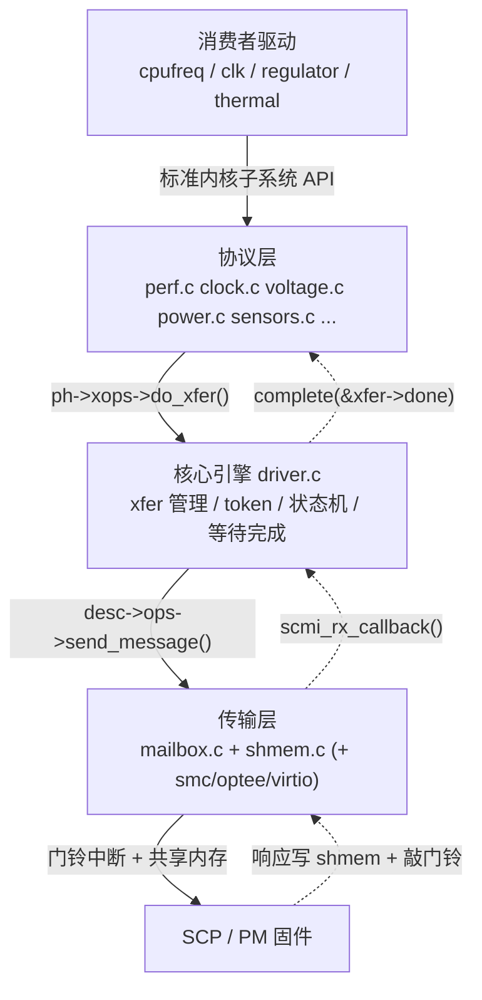

[[xfer-SCMI 的原子货币]]


理解。你这个观察非常关键,我先回应"内存日志"这个点,然后给你一份成体系的 SCMI 学习路线。先快速确认一下你这棵树里 arm_scmi 的文件构成,好让学习地图对得上实际代码。 

Recovered from a request error文件构成清楚了,正好可以对着你这棵树讲。先回应你那个很关键的观察。

## 关于"写内存而不是串口"——你的判断是对的

这是教科书级的 **Heisenbug(观察行为改变了被观察对象)**:

- `pr_err`/`printk` 到串口是**同步**的,boot 阶段 115200 波特率下,一行约 80 字符 ≈ **7ms**。我那个 dump 一次打 3~4 行 ≈ 20~30ms。
- 更关键:如果你在 ISR 或热路径里加了 print,那串口耗时会**直接挤占** SCMI 完成中断的处理时机,于是"加了 print 反而 PM 看起来正常响应了"——因为 print 拖慢了整体节奏,把原本紧张的时序"撑松"了。
- 所以你看到的"PM 给了门铃响应",有可能是 print 副作用,不能下结论。**写内存 ring buffer(零格式化、纳秒级)再事后/panic 时回读**,才是不扰动时序的正确观测法。

如果需要,我可以把 `shmem_dump_status` 改成**写一个静态环形缓冲区**(记录 `ktime + seq + channel_status + token`),通过 debugfs 或 panic notifier 回读,正常路径零串口开销。你说已按这个思路开始压测了——要我提供一份干净实现供你对照吗?我先不动你正在跑测试的代码,免得冲突。

---

# SCMI 驱动系统学习

下面这份是对着你 drivers/firmware/arm_scmi/ 这棵树写的,所有引用都能在你本地找到对应。

## 0. 它到底解决什么问题

AP(跑 Linux 的大核)自己**不能**直接配电压、调频率、开关电源域、读温度——这些都归一颗独立的管理微控制器 **SCP/PM** 管。SCMI 就是 AP 和 SCP 之间的一套**标准化 RPC 协议**(ARM DEN 0056)。Linux 侧 = 客户端,SCP 固件 = 服务端。

## 1. 四层架构

这是理解一切的骨架。**从上到下**:



**每一层只跟相邻层打交道**,通过函数指针解耦:
- 协议层→核心:`struct scmi_xfer_ops`(`do_xfer`/`xfer_get_init`/...)
- 核心→传输:`struct scmi_transport_ops`(`send_message`/`fetch_response`/...,就是你刚加 `dump_status` 的那个结构)

## 2. 文件地图(你的树)

| 文件 | 层 | 职责 |
|---|---|---|
| driver.c | 核心 | **最该精读**。xfer 分配/token/状态机/`do_xfer`/收发/probe |
| common.h | 核心 | `scmi_xfer`/`scmi_chan_info`/`scmi_desc`/`scmi_transport_ops` 等核心结构 |
| bus.c | 核心 | `scmi_bus` 总线,协议驱动注册/匹配 |
| notify.c | 核心 | 通知(异步事件)子系统 |
| protocols.h | 协议 | 协议层公共定义、`scmi_xfer_ops`/`scmi_proto_helpers_ops` |
| perf.c | 协议 | **DVFS,你 15/16 超时的元凶协议(id=0x13=19)** |
| clock.c / power.c / voltage.c / sensors.c / reset.c / system.c / powercap.c / base.c | 协议 | 各功能协议 |
| mailbox.c | 传输 | SCMI↔内核 mailbox 框架桥接 |
| shmem.c | 传输 | 共享内存 SMT 区读写(你加 dump 的地方) |
| cix-mailbox.c | 厂商 | CIX 门铃硬件驱动(0xc8/0xc4 寄存器) |

## 3. 五个核心数据结构

精读 driver.c 前先把这五个记住:

1. **`scmi_info`** — 一个 SCMI 实例(对应一个 `arm,scmi` 节点)。持有 `tx_minfo`/`rx_minfo`(消息池)、`tx_idr`/`rx_idr`(协议号→通道)、`protocols`、`version`、`desc`。
2. **`scmi_xfer`**(common.h)— **一次事务**。含 `hdr`(protocol/msg/seq/type/status)、`tx`/`rx` 缓冲、`done`(completion)、`state`、`lock`、`busy`。整个驱动围着它转。
3. **`scmi_chan_info`** — 一条通道(TX 或 RX),`transport_info` 指向传输私有数据(mailbox 里就是 `scmi_mailbox`)。
4. **`scmi_desc`** + **`scmi_transport_ops`** — 传输描述符。你的 `scmi_mailbox_desc`(`max_rx_timeout_ms=300`)就是它。
5. **`scmi_protocol`** — 一个协议的注册描述(id + `instance_init` + `ops`),通过 `scmi_protocol_register` 进全局 idr。

## 4. 三条主干流程

### (A) 初始化:`scmi_probe()`

```
scmi_probe (driver.c)
 ├─ scmi_channels_setup()      // 解析 DT/ACPI,为每协议建 TX/RX 通道
 │   └─ chan_setup → mailbox_chan_setup()  // 申请 mbox、ioremap shmem
 ├─ scmi_xfer_info_init()      // 预分配 xfer 池
 │   └─ __scmi_xfer_info_init()  // init_completion / spin_lock_init,一次性
 ├─ scmi_notification_init()
 └─ scmi_protocol_acquire(BASE) // 第一次握手,确认能跟 SCP 通信
```

协议驱动(perf 等)的注册其实在更早的 `scmi_driver_init()` 里(driver.c 末尾):`scmi_perf_register()` / `scmi_clock_register()` ... 通过 `subsys_initcall_sync` 触发。

### (B) 发一条命令:`do_xfer()`——最重要的一条链

```
protocol 层 (如 perf version_get)
 └─ ph->xops->do_xfer(ph, t)
     └─ do_xfer()  (driver.c)
         ├─ reinit_completion(&xfer->done)   // done=0
         ├─ xfer->state = SCMI_XFER_SENT_OK
         ├─ smp_mb()                          // 屏障:防 RX 早到看到旧 state
         ├─ desc->ops->send_message()
         │   └─ mailbox_send_message() → mbox_send_message()
         │       └─ tx_prepare()→shmem_tx_prepare()  // 写命令进 shmem,置 BUSY
         │       └─ cix_mbox_send_data_db()  // 敲门铃 REG_DB_ACK bit0
         └─ scmi_wait_for_message_response()
             └─ scmi_wait_for_reply()  (driver.c ~L1040)
                 └─ wait_for_completion_timeout(&done, 300ms)  // 你超时的那行
```

### (C) 收响应:中断路径——`do_xfer` 的"另一半"

```
SCP 写响应进 shmem → 置 channel FREE → 敲门铃
 → GIC → cix_mbox_isr() → cix_mbox_isr_db() (RX分支, 读0xc8)
     └─ mbox_chan_received_data()
         └─ rx_callback()  (mailbox.c)   // 这里有 spurious A2P IRQ 守卫
             └─ scmi_rx_callback()  (driver.c)
                 └─ scmi_handle_response()
                     ├─ scmi_xfer_command_acquire()  // 按 seq 找回 xfer + 状态校验
                     ├─ fetch_response()→shmem_fetch_response()  // 读响应到 rx.buf
                     └─ complete(&xfer->done)   // ←唤醒 (B) 里睡着的等待者
```

**(B) 睡、(C) 唤醒**——这就是你这次 bug 的全部战场。超时 = (C) 没能调到 `complete()`。你加的 `dump_status` 正是在 (B) 超时返回那刻去读 shmem,判断是 SCP 没写(没走到 C)还是 C 没被触发。

## 5. token / seq 机制(并发的关键)

- 每个在途 xfer 分配一个**单调递增**的 token(`scmi_xfer_token_set`,driver.c),塞进 `hdr.seq`,占用 `xfer_alloc_table` 位图。
- SCP 响应里带回这个 seq,`scmi_handle_response` 用它在 `pending_xfers` 哈希表里**反查**是哪条 xfer。
- 单调递增是为了**避免刚超时的旧 token 被立刻复用**,导致一条迟到的旧响应被错认成新事务(注释里画了 ASCII 图,值得一读)。这也是为什么你 dump 里要比对 `token == xfer->hdr.seq`。

## 6. xfer 状态机 + 并发保护

状态(`scmi_msg_response_validate` / `scmi_xfer_state_update`):
```
SCMI_XFER_SENT_OK ──收到RESP──> SCMI_XFER_RESP_OK ──收到DRESP──> SCMI_XFER_DRESP_OK
```
两把锁分工明确:
- `minfo->xfer_lock`:保护**池/位图/哈希表**(分配、注册、查找)。
- `xfer->lock` + `xfer->busy`(atomic):保护**单条 xfer 的状态翻转**,处理 RESP 与 DRESP 并发到达的罕见竞争。

## 7. 三种等待策略(`scmi_wait_for_reply`)

| 模式 | 条件 | 机制 |
|---|---|---|
| **睡眠等待** | 普通同步命令(你的情况) | `wait_for_completion_timeout`,靠中断唤醒 |
| **轮询** | `poll_completion` 且传输支持 | `spin_until_cond(poll_done)` 忙等 shmem 状态 |
| **异步** | `do_xfer_with_response` | 先同步 ACK,再等一条 Delayed Response |

## 8. 通知子系统(notify.c)

SCP 主动上报的事件(如温度越限、电源状态变化),走 **P2A 方向**(`MSG_TYPE_NOTIFICATION`),由 `scmi_handle_notification` 处理,经一套 workqueue + 事件链分发给注册者。和命令-响应是**两条独立路径**,先放后面学。

## 9. CIX 定制点(你这棵树特有)

- `CONFIG_PM_EXCEPTION_PROTOCOL`:shmem 布局被改过(多了 `statusCode`/`traceCode`/带 token 的 `pm_header`,见 shmem.c 顶部的 `#else` 分支),还有 protocol_id `0x81` 的定制协议。
- cix-mailbox.c:门铃硬件。`INT_STATUS(0xc8)` 读 pending、`INT_CLEAR(0xc4)` W1C、`REG_DB_ACK(0x80)` 敲门铃/回 ACK。11 个通道共用一组寄存器。

## 10. 建议的学习路径

**第一遍(读懂一次命令的来回)**,按这个顺序读:
1. common.h 的 `scmi_xfer` / `scmi_transport_ops` / `scmi_desc` 三个结构
2. `do_xfer()` → `scmi_wait_for_reply()`(发送+等待)
3. `scmi_rx_callback()` → `scmi_handle_response()`(接收+唤醒)
4. `mailbox.c` 全文(它短,把传输层串起来)
5. shmem.c 的 `tx_prepare`/`fetch_response`/`channel_status`

**第二遍(初始化与生命周期)**:`scmi_probe` → `scmi_channels_setup` → `__scmi_xfer_info_init`;再看 `scmi_xfer_token_set` 的注释图。

**第三遍(协议层怎么用核心)**:挑 perf.c(你的故障协议),看它怎么 `xfer_get_init` → 填 `tx.buf` → `do_xfer` → 解析 `rx.buf`。

**动手实验(结合你的 bug,最能学进去)**:
1. 在 `do_xfer` 发送前、`scmi_handle_response` 入口各记一条**内存** trace(seq+ktime),复现后比对——直接看到"发了没回"。
2. `cat /sys/kernel/debug/scmi/0/...` 看 debugfs 暴露的 `max_rx_timeout_ms` 等。
3. 打开内核自带 tracepoint:`echo 1 > /sys/kernel/debug/tracing/events/scmi/enable`,`scmi_xfer_begin`/`scmi_xfer_end`/`scmi_rx_done` 全程无 printk 开销——**这正好是你要的"不扰动时序"的观测法**,比自己加 print 强得多。

最后一条特别提醒:内核 **`trace_scmi_*` tracepoint 写的是 ftrace ring buffer(内存)**,零串口开销。你想"写内存看 PM 有没有传中断",其实驱动里已经埋好了 `trace_scmi_rx_done`——复现时 enable 它,看超时的那个 seq 有没有对应的 `rx_done` 记录,**有=PM 回了中断到了核心层,无=没到**。要不要我带你把这套 tracepoint 观测流程跑起来?