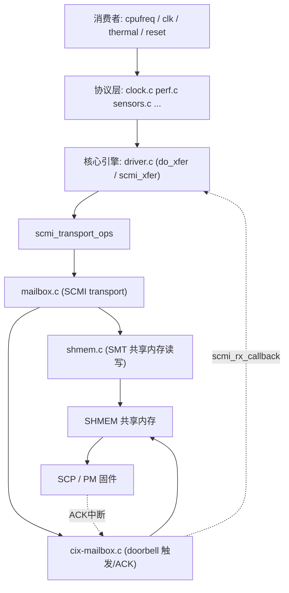

# SCMI 子系统 Top-Down 全景

## 第 0 层：SCMI 是什么，为什么存在

**SCMI** = System Control and Management Interface，是 ARM 出的一份标准协议（文档号 **DEN0056**）。

解决的问题：现代 SoC 上，时钟、电压、功耗、传感器、复位这些"系统级资源"往往不归 Linux 直接管，而是交给一颗专门的小核（**SCP / PM**）统一管理。Linux（AP）想调频、开时钟、读温度，就得**向 SCP 发标准化请求**。SCMI 就是这套"请求语言"。

```
┌─────────────────────────── AP (Linux) ───────────────────────────┐
│  cpufreq  clk框架  regulator  thermal  reset  ...  各内核子系统    │
│      │       │        │         │       │                        │
│      └───────┴────────┴─────────┴───────┘                        │
│                    SCMI 协议层（本文重点）                          │
│                          │                                       │
│                  Transport（mailbox / SMC / virtio）              │
└──────────────────────────┼───────────────────────────────────────┘
                           │ 共享内存 + doorbell
┌──────────────────────────┼──────────────────────────────────────────┐
│                    SCP / PM 固件（另一颗核）                          │
│   真正去操作 PLL、电源开关、ADC、复位线                                 │
└─────────────────────────────────────────────────────────────────────┘
```

---

## 第 1 层：分层模型（四层）

SCMI 在 Linux 里是一个清晰的四层结构，从上到下：

```
① Protocol 消费者层   cpufreq-scmi / clk-scmi / scmi-cpufreq / hwmon ...
                       （这些是"用户"，不在 arm_scmi/ 目录）
─────────────────────────────────────────────
② Protocol 实现层      clock.c power.c perf.c sensors.c reset.c
                       voltage.c powercap.c system.c base.c
                       （每个 SCMI 协议一个文件）
─────────────────────────────────────────────
③ 核心 / 总线层        driver.c（核心引擎）bus.c（scmi_bus）
                       notify.c（通知）common.h protocols.h
─────────────────────────────────────────────
④ Transport 层         mailbox.c / smc.c / optee.c / virtio.c
                       shmem.c（共享内存读写）msg.c
```

对照 drivers/firmware/arm_scmi/ 下的文件，每一个 .c 都能在上面找到位置。

---

## 第 2 层：核心概念（贯穿所有代码的 4 个名词）

### 1. Protocol（协议）

每类资源一个协议号：

| 协议 ID | 名称 | 文件 | 干什么 |
|---|---|---|---|
| 0x10 | Base | base.c | 发现 SCP 支持哪些协议、版本 |
| 0x11 | Power Domain | power.c | 电源域开关 |
| 0x13 | **Powercap** | powercap.c | 功耗封顶 |
| 0x14 | **Clock** | clock.c | 时钟开关/调频（DP 调试时卡住的就是它） |
| 0x13/0x14... | Perf | perf.c | DVFS 性能级别（cpufreq 用） |
| 0x15 | Sensor | sensors.c | 温度/电压传感器 |
| 0x16 | Reset | reset.c | 复位控制 |
| 0x17 | Voltage | voltage.c | 电压域 |
| 0x18 | System Power | system.c | 关机/重启 |

### 2. Message（消息）

一次请求由 **(protocol_id, message_id, token)** 唯一确定，编码进 `msg_header`：

```
msg_header (32-bit):
 bits[9:0]   message_id   （哪条命令，如 CLOCK_RATE_GET=0x6）
 bits[17:10] protocol_id  （哪个协议，如 0x14）
 bits[27:18] token        （序列号，匹配请求/应答）
```

消息分三类：**command（同步命令）**、**delayed response（延迟应答）**、**notification（异步通知，如温度越限）**。

### 3. Transport（传输）

SCMI 不规定怎么把消息送过去，由 transport 抽象。CIX 用的是 **mailbox + SMT 共享内存**。每个 transport 实现一组 ops（`send_message`、`fetch_response`、`mark_txdone`...），定义在 `common.h` 的 `struct scmi_transport_ops`。

### 4. Xfer（一次传输事务）

`struct scmi_xfer` 是核心数据结构，代表"一次正在进行的请求"——`do_xfer()` 就是围着它转的。包含 header、tx buffer、rx buffer、`completion done`、状态机。

---

## 第 3 层：一次完整调用的数据流（落到函数）

以 `scmi_clock_rate_get` 为例，串起所有层：

```
clk_get_rate()                         ← ① 消费者层（DP 驱动）
  scmi_clk_recalc_rate()               ← clk-scmi provider 回调
    clk_ops->rate_get
      scmi_clock_rate_get()            ← ② 协议层  clock.c
        ├─ xfer_get_init(CLOCK_RATE_GET)  分配 xfer，填 header
        ├─ put_unaligned_le32(clk_id, xfer->tx.buf)  填参数
        └─ do_xfer(ph, xfer)           ← ③ 核心层  driver.c
             ├─ info->desc->ops->send_message()
             │    └─ mailbox.c: mark + shmem.c: smt_send_message()
             │         ├─ memcpy_toio 把请求写进 SHMEM
             │         └─ mbox_send_message() → cix_mbox doorbell  ← ④ transport
             │              cix_mbox_send_data_db(): 写 0x80=0x1
             ├─ wait_for_completion_timeout(&xfer->done, 30ms)  ← 睡等
             │      ⟵ SCP 处理完，回 ACK 中断
             │      ⟵ cix_mbox_isr_db → mbox rx_callback
             │      ⟵ scmi_rx_callback() → complete(&xfer->done)
             └─ info->desc->ops->fetch_response()
                  └─ shmem.c: smt_fetch_response() 从 SHMEM 读 8 字节 rate
      ← 返回 rate
```

**超时就发生在 `wait_for_completion_timeout`**（driver.c），SCP 没回 ACK → `-ETIMEDOUT` → 你加的 panic 截住的位置。

---

## 第 4 层：关键文件逐个拆解

下面按"该先读哪个"的顺序，给出一条阅读路径。建议照这个顺序读 arm_scmi 下的源码。

### (A) common.h / protocols.h —— 先读，建立词汇表

定义所有核心结构体：

- `struct scmi_xfer`：一次事务。
- `struct scmi_desc`：一个 transport 的描述（max_msg、max_msg_size、ops）。
- `struct scmi_transport_ops`：transport 必须实现的回调（`send_message`/`fetch_response`/`poll_done`...）。
- `struct scmi_protocol`：一个协议的注册信息。
- `MSG_*` 宏：msg_header 的位段打包/解包。

### (B) bus.c —— SCMI 自己的"总线"

SCMI 仿照 platform/pci，建了一条 **`scmi_bus`**。每个协议消费者（如 clk-scmi）是一个 `scmi_device`，挂在这条总线上，靠 `protocol_id` 匹配 `scmi_driver`。对应 `scmi_bus_type`、`scmi_device_register()`、`scmi_driver_register()`。

### (C) driver.c —— 核心引擎（最重要）

整个子系统的心脏，几个关键函数：

| 函数 | 作用 |
|---|---|
| `scmi_probe()` | 探测 SCP，初始化 transport，建 base 协议 |
| `scmi_xfer_get_init()` | 从 xfer 池分配一个事务并初始化 header |
| `do_xfer()` | **发送 + 等待应答**的主流程（SCMI 超时就发生在这里） |
| `scmi_wait_for_message_response()` / `scmi_wait_for_reply()` | 等待逻辑（poll 或中断两条路径） |
| `scmi_rx_callback()` | transport 收到应答时回调它 → `complete(done)` |
| `xfer_put()` | 归还事务到池 |

### (D) shmem.c —— SMT 共享内存读写

实现 SCMI 规范的 **Shared Memory Transport** 布局（`struct scmi_shared_mem`，带 `__le32` 字段的结构体）。核心：

- `shmem_tx_prepare()`：把 xfer 写进 SHMEM（设 header/length/payload，清 CHANNEL_FREE）。
- `shmem_read_header()` / `shmem_fetch_response()`：从 SHMEM 读回应答。
- `shmem_poll_done()`：轮询模式判断 SCP 是否回完。

### (E) mailbox.c —— 把 SMT 接到 CIX mailbox

实现 `scmi_transport_ops`，把上面的 shmem 操作和 cix-mailbox.c 的 mbox client 接口缝起来：

- `mailbox_send_message()` → `shmem_tx_prepare()` + `mbox_send_message()`（触发 doorbell）。
- `rx_callback`（mbox client 回调）→ `scmi_rx_callback()`（通知 driver.c 应答到了）。
- `mailbox_fetch_response()` → `shmem_fetch_response()`。

> 这就是 SCMI 核心和 cix-mailbox.c 的**接缝点**。

### (F) clock.c（或 perf.c）—— 一个协议的范本

读懂一个协议，其它都同理。clock.c 里：

- `scmi_clock_protocol_init()`：向 SCP 查询有几个 clock（`CLOCK_ATTRIBUTES`）。
- `scmi_clock_rate_get()` / `scmi_clock_rate_set()` / `scmi_clock_enable()`：每个对应一条 message_id，内部都走 `xfer_get_init → do_xfer`。
- 末尾 `DEFINE_SCMI_PROTOCOL_REGISTER_UNREGISTER` 把自己注册进核心。

### (G) notify.c —— 异步通知

处理 SCP 主动推来的事件（温度越限、电源状态变化）。和 command 不同，notification 是 SCP 单向发起，走 `scmi_notify()` → 通知链。初学可暂时跳过。

---

## 第 5 层：建议的学习路线

自底向上（先吃透 mailbox + SHMEM + doorbell，再往上补中间两层）：

1. **读 common.h**，认全 `scmi_xfer` / `scmi_desc` / `scmi_transport_ops` 三个结构体——这是所有代码的"名词表"。
2. **读 driver.c 的 `do_xfer()` 全文**，把 mailbox 调用嵌进去，确认"发送→等待→fetch"三段。
3. **读 mailbox.c**，看它如何把 `scmi_transport_ops` 接到 cix-mailbox.c，找到 `rx_callback → scmi_rx_callback → complete(done)` 这条"唤醒"路径——这正好解释超时时"complete 没被调用"的现象。
4. **读 clock.c 的 `scmi_clock_rate_get()`**，对照 DP 那条 backtrace，闭环。
5. 选读 bus.c（理解 scmi_device 怎么 probe）、notify.c（异步事件）。

---

## 一张总结图

